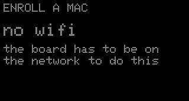
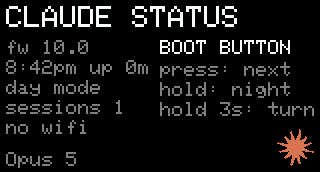
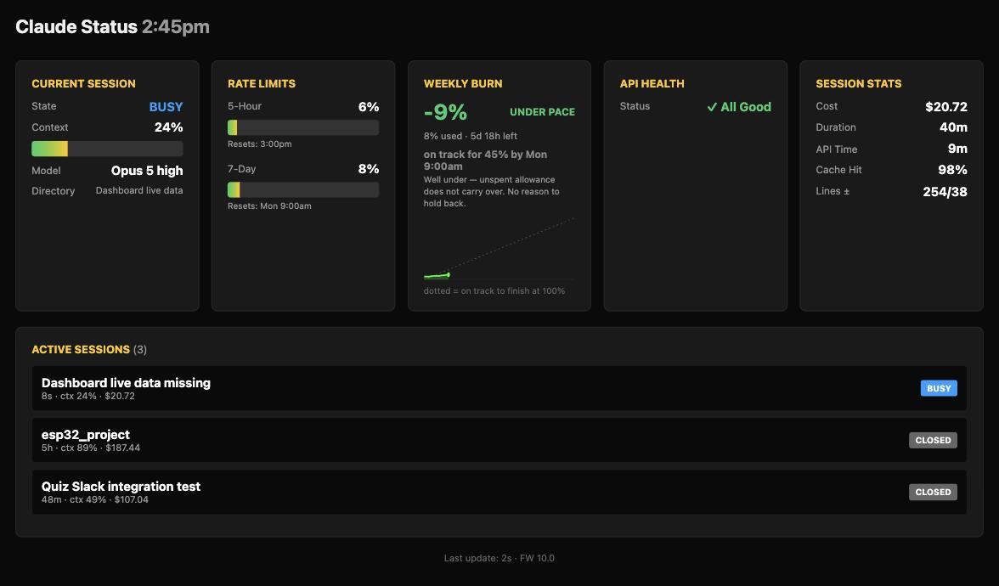

# Claude Code status display

A small screen for your desk that shows what Claude Code is up to: context window, the 5-hour
and weekly rate limits, whether it's working or waiting on you, and whether the Claude API is
healthy. An RGB LED under the board glows the same color as the screen, so you can read the
state from across the room.


Yellow means Claude is done and waiting on you. Red-orange means it's blocked and can't carry on
without you. It runs on any USB-C power supply, so it doesn't need to stay tethered to the
laptop.

*(That photo predates the color change and still shows the old amber. The captures below are
current; a photograph is the one thing here that can't be regenerated.)*

### The pages

| | |
| --- | --- |
| **Overview** is the everyday view. CTX shows its window size, since 86% of 1M is not 86% of 200K. | **Sessions** lists every live window, sorted so the top row is the thing to do next. |
|  |  |
| **Weekly burn** is spend against an even pace, where the week lands if nothing changes, and which dial to turn. | **Limits** shows both windows with exact reset times. |
|  |  |
| **Stats** is the useful part of `/usage`, including cache hit rate and how long the cache stays warm. | **API** shows Claude API and Claude Code health, incidents in amber. |
|  |  |
| **Enroll** is how another Mac joins: one command, and a code good for ten minutes after power-up. | **About** is firmware, clock, uptime, session count, and the address the router handed out. |
|  |  |

### The same thing in a browser

Once the board is on the network, `http://claude-status.local/dashboard` is every page at once,
for when you're already looking at a screen. No install and no account: the board serves it.



It polls `/api/status` every two seconds, which is the same JSON the board draws from and is
worth pointing your own things at. That endpoint needs no token, on the grounds that anyone who
can open the dashboard can already read everything in it — writing to the board still does.

The page says what the board says: BUSY, READY, NEEDS YOU, the same session ranking, the same
even-spend reference. Where it has room the board doesn't, it spends it — full session names
rather than the twelve characters a 172px row holds, and the effort level beside the model.

**You don't need this exact board.** Claude Code already publishes everything shown here through
documented interfaces, so any display you own can show it: a spare phone, an e-ink badge, a
Stream Deck, an LED strip, a menu-bar item, a smart bulb that turns amber when Claude is waiting
on you. The glue is about thirty lines. Everything else in this repo is one way to use it.

Hand your coding agent [AGENTS.md](AGENTS.md) and a prompt like:

> Read AGENTS.md in github.com/chewrocca/claude-status-display. Build me a macOS menu-bar item
> using the same data path: a colored dot for the state and the weekly rate limit as a
> percentage. Amber when Claude is waiting on me. No hardware.

## What you need

- **Waveshare ESP32-C6-LCD-1.47**, the non-touch model. No other hardware, no soldering.
- **A Mac.** The daemon is portable Python, but the installer and the launchd service are
  macOS-only. Linux would need a systemd unit; nobody has written one.
- **A Claude Pro or Max subscription** for the rate-limit gauges. Those fields aren't present on
  API-key billing, so 5HR and WEEK sit empty. Everything else still works.
- Optionally a printed case. See [hardware notes](docs/hardware.md#the-case).

## Setup

Clone the repo and run the installer:

```sh
./host/install.sh
```

That creates the state directories, installs the hook, patches `~/.claude/statusline.sh` to
mirror its payload (keeping a dated backup), registers the hooks in `~/.claude/settings.json`,
and loads the launchd agent. It then prints the flash and Wi-Fi steps. Restart Claude Code
afterwards so the hooks load.

It needs `jq` (the hook parses its input with it), `uv` (the daemon is a uv script), and
`python3`. The installer checks and says which are missing.

### Flashing

```sh
brew install arduino-cli
arduino-cli config set board_manager.additional_urls https://espressif.github.io/arduino-esp32/package_esp32_index.json
arduino-cli core install esp32:esp32
arduino-cli lib install "Adafruit GFX Library" "Adafruit ST7735 and ST7789 Library" "Adafruit NeoPixel" "ArduinoJson"

launchctl bootout gui/$(id -u)/com.claude-status.display   # free the serial port
arduino-cli compile --fqbn esp32:esp32:esp32c6:CDCOnBoot=cdc,PartitionScheme=no_ota --build-path firmware/build firmware/claude_status
arduino-cli upload  --fqbn esp32:esp32:esp32c6:CDCOnBoot=cdc,PartitionScheme=no_ota --port /dev/cu.usbmodem* --input-dir firmware/build firmware/claude_status
launchctl bootstrap gui/$(id -u) ~/Library/LaunchAgents/com.claude-status.display.plist
```

Run `python3 host/gen_payload.py` first if you've changed `install.sh`, the hook, or the daemon:
the board serves those files and would otherwise hand out a stale copy.

### Wi-Fi

Provision once over USB, then the board runs anywhere on 5V. **The ESP32-C6 radio is 2.4 GHz
only** — a 5 GHz-only SSID never connects and the board just sits at "connecting".

```sh
uv run --script host/provision.py --list     # networks this Mac has saved
uv run --script host/provision.py --op "op://Private/Router/Wi-Fi/home-2.4" --ssid "NAME"
uv run --script host/provision.py --auto --ssid "NAME"   # password from the macOS keychain
uv run --script host/provision.py --status   # ip, rssi, ntp, ble, clock
uv run --script host/provision.py --forget   # wipe credentials from the board
```

The password is never printed or written to disk. The About page shows the address the router
handed out, so you can read it off the screen. Once on the network the board is
`http://claude-status.local`, and it fetches the Claude status page and NTP itself, so the clock
and API row stay right with the laptop closed.

### A second machine

No cable and no flashing. Press BOOT round to the Enroll page, which shows the command and a
six-digit code:

```sh
curl -fsS 192.168.10.178/install.sh | sh
```

The screen breaks that across two lines and ends the first with a backslash, which is the
shell's own line continuation — type both lines exactly as shown and you get this one command.
It asks for the code, trades it for the shared token, and takes everything else it needs from
the board. Where there's no terminal to ask on, `export CLAUDE_STATUS_CODE=<code>` first.

Several machines at once is fine: payloads say which machine sent them and the board merges
them. Details in [internals](docs/internals.md#several-machines).

## The display

- Landscape by default, band on the left and gauges on the right. Every page also has a portrait
  layout. Reset times are 12-hour America/Chicago.
- **Gauges below 70% collapse to one dim line.** Low numbers don't need a full bar. The space
  goes to weekly burn against an even pace, with a dotted reference showing where an even burn
  would put you. Cross 70% and that gauge expands to a full bar with its reset time.
- **The Sessions page** is one row per live session, sorted so the top row is the thing to do
  next: blocked first, longest wait first. Finished over 30 minutes ago reads "closed" rather
  than "ready". The LED pulses once per blocked session, so two pulses means two things are
  waiting.
- **Weekly burn ends with a conclusion.** Pace compares this week to an even spend, which isn't
  the question you're asking: 9% under pace still finishes the week at 45%, and what's unspent
  at the reset is gone. So the page also projects where the current rate lands, and names the
  dial to turn — `raise effort`, `lower effort`, `use sonnet`, `on target`. It reads the model
  and effort you're actually on, so it never suggests one you're already using. A nearly spent
  5-hour window takes that line instead, because being minutes from a cut-off outranks the week.
  It's a straight-line projection from the week so far, so it swings early in the week and
  settles as the week fills in.
- **The health row** replaces the session row when the API isn't operational: ALL GOOD, DEGRADED,
  OUTAGE, CRITICAL, or UNKNOWN. The LED carries the same thing as a tick over whatever the
  session state is doing. A Cowork-only incident doesn't raise a warning.
- **Losing the daemon costs freshness, not data.** The last known numbers stay up, the band
  freezes to a muted version of the last state and stops animating, and an amber age replaces
  the model row. NO LINK only shows when the board has never received anything.
- Stale data, over ten minutes old, is drawn dim with a "?" in the band.

Press BOOT to cycle pages, and again to return to the overview after 20 s. The board only rests
when nothing wants you: a permission prompt never falls behind the screensaver, and neither does
anything else while another window is still working. A finished turn insists for 15 minutes and
then rests, because a panel that stays lit until someone walks over is a nag rather than a
signal.

Idle for a minute and it cycles the pages; at five minutes a starfield screensaver with the
clock and both rate limits, plus a cache-expiry warning if one is due; at ten minutes the
backlight goes off entirely. Dark, not asleep — the LED keeps carrying the state, which is the
part that reads across a room. Any tap or state change wakes it.

## Colors

Warm means the machine wants you. The band and the LED both derive from one function, so they
can't drift apart.

| State | Color | LED motion |
| --- | --- | --- |
| BUSY | rainbow, one lap every 6 s (the band cycles with it) | steady at that hue |
| READY | yellow `(255,200,0)` | three quick pulses, steady glow, softer after 2 min |
| NEEDS YOU | red-orange `(255,60,0)` | insistent breathe until acknowledged |
| RATE LIMIT | magenta `(255,0,255)` | slow breathe |
| OUTAGE | red `(255,0,0)` | breathe, or a red tick every 3 s over another state |
| IDLE / NO LINK | gray `(32,32,32)` | dim pilot light, or slow blink |

Tap BOOT to acknowledge an alert. Hold 0.8 s for night mode, 3 s to rotate the screen (it
remembers). Night mode is automatic from 10 PM to 7 AM Central.

## Pieces

| Path | Role |
| --- | --- |
| `firmware/claude_status/` | Arduino sketch. ESP32-C6, ST7789 172x320, WS2812 LED, BOOT button. |
| `firmware/claude_status/sprite_*.h` | 64x64 RGB565 pixel-art astronaut, one pose per state, from `host/gen_sprite.py`. |
| `host/claude_status_daemon.py` | uv script. Reads state files and transcripts, polls status.claude.com, pushes one JSON line per change over serial or HTTP. |
| `host/esp32-status-hook.sh` | Claude Code hook. Records per-session state, cwd, and transcript path. |
| `host/install.sh` | Everything outside the repo. Also served by the board. |
| `host/gen_payload.py` | Embeds the host files into the firmware so the board can install a machine on its own. |
| `host/screenshot.py` | Dumps the live framebuffer to PNG over serial or HTTP. |
| `host/provision.py` | Wi-Fi credentials and the shared token, over USB. |

Data flow: `statusline.sh` mirrors its JSON to `~/.claude/esp32-status/sessions/<id>.json` and
hooks write `attention/<id>.json`. The daemon merges those with the status page and writes one
JSON line to `/dev/cu.usbmodem*`, or `POST /status` when there's no cable. Those two directories
are the only state it keeps; window sizes and the weekly curve live on the board.

## More

- [Internals](docs/internals.md) — where the numbers come from, context window sizes, running
  several machines, why enrollment has a code, and the color language.
- [Hardware notes](docs/hardware.md) — the board, the microSD slot, the case, and how the
  firmware survives being left alone.
- [AGENTS.md](AGENTS.md) — written for a coding agent building its own version.

Screenshots come from the device itself: stop the launchd agent and run
`uv run --script host/screenshot.py out.png --live`.

## License

MIT. See LICENSE.
