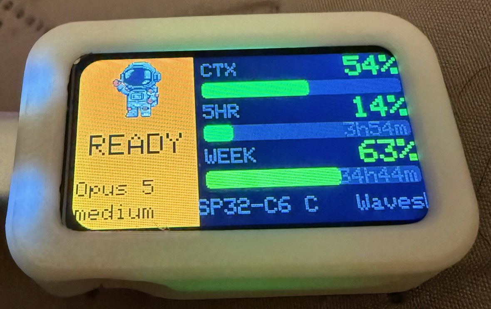
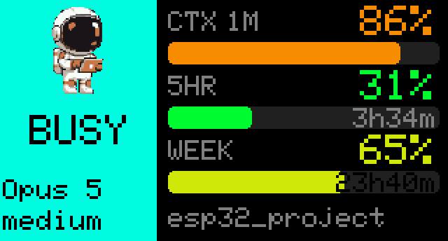
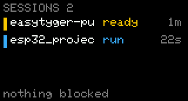
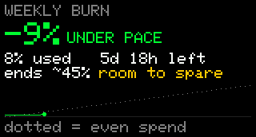
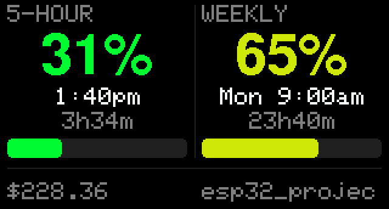
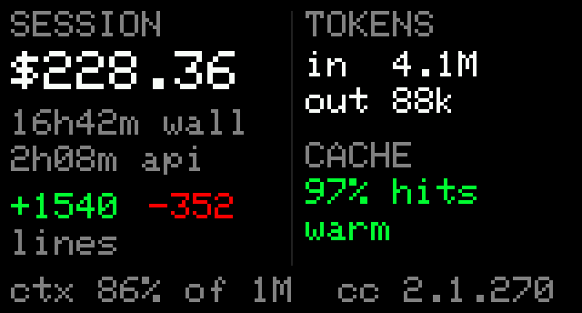
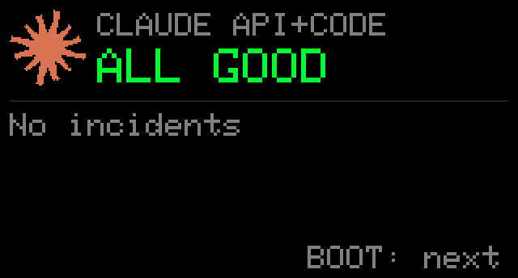

# Claude Code status display

A small screen for your desk that shows what Claude Code is up to: context window, the
5-hour and weekly rate limits, whether it's working or waiting on you, and whether the
Claude API is healthy. An RGB LED under the board glows the same color as the screen, so
you can read the state from across the room.



Amber means Claude is done and waiting on you. It runs on any USB-C power supply, so it
doesn't need to stay tethered to the laptop.

### The pages

| | |
| --- | --- |
| **Overview** is the everyday view. CTX shows its window size, since 86% of 1M is not 86% of 200K. | **Sessions** lists every live window, sorted so the top row is the thing to do next. |
|  |  |
| **Weekly burn** is spend against an even pace. Above the dotted line means you're running hot. | **Limits** shows both windows with exact reset times. |
|  |  |
| **Stats** is the useful part of `/usage`, including prompt-cache hit rate and how long the cache stays warm. | **API** shows Claude API and Claude Code health, with incidents in amber. |
|  |  |

You don't need this exact board. Claude Code already publishes everything shown here
through two documented interfaces, so any display you own can show it: a spare phone, an
e-ink badge, a Stream Deck, an LED strip, a menu-bar item, a smart bulb that turns amber
when Claude is waiting on you. The [data path](#where-the-data-comes-from) is about thirty
lines of glue. Everything else in this repo is one way to use it.

## Build your own version

If you want a version that fits your desk, hand your coding agent [AGENTS.md](AGENTS.md)
and a prompt like one of these:

> Read AGENTS.md in github.com/chewrocca/claude-status-display. Build me a macOS menu-bar
> item using the same data path: a colored dot for the state and the weekly rate limit as a
> percentage. Amber when Claude is waiting on me. No hardware.

> Read AGENTS.md in github.com/chewrocca/claude-status-display. I have a Hue bulb. Wire the
> attention state to it: calm while Claude works, amber when it's my turn, and something
> insistent when it's blocked on a permission prompt. Ignore the numbers entirely.

> Read AGENTS.md in github.com/chewrocca/claude-status-display. I have an old iPad. Serve a
> local page from the daemon showing the three gauges and the state, big enough to read from
> across the room.

Each one is an afternoon of work at most. The hard part is already done: Claude Code
publishes this through its status line and hooks, and the rules for merging it correctly
across several sessions are written down.

## What you need

- **Waveshare ESP32-C6-LCD-1.47**, the non-touch model. No other hardware, no soldering.
  The 802.15.4 radio goes unused.
- **A Mac.** A launchd agent pushes status to the board. The daemon itself is portable
  Python, but the installer and the service definition are macOS-only. Linux would need
  a systemd unit; nobody has written one yet.
- **A Claude Pro or Max subscription** for the rate-limit gauges. Those fields aren't
  present on API-key billing, so the 5HR and WEEK bars will sit empty. Everything else
  still works.
- Optionally a printed case. See [Hardware notes](#hardware-notes) for the one in the photos.

## Where the data comes from

No polling, no API key, no scraping. Two documented interfaces already publish everything:

- **The status line.** Claude Code runs a command on every update and hands it a JSON blob
  on stdin: context window, both rate-limit windows with reset times, model, effort, cost.
  Two lines added to an existing status line script also write that payload to a file per
  session. See `host/install.sh`.
- **Hooks.** `Stop` fires when Claude finishes a turn. `Notification` with a
  `permission_prompt` or `elicitation_dialog` type fires when a dialog has been waiting.
  `PreToolUse` matched on `AskUserQuestion` catches Claude asking you something. Each writes
  a small file. See `host/esp32-status-hook.sh`.
- **The transcript**, for sessions that run no status line. Claude Code in the desktop app
  fires hooks but draws its own usage panel instead of running a status line command, so no
  payload ever appears for it. The hook passes on `transcript_path`, and every assistant
  record in that file carries a `usage` block, so the context tokens, model and version can
  be read from its tail. Rate limits are not in there and are not available any other way, so
  they are borrowed from whichever window last asked, which is legitimate because every
  window spends the same account allowance. A borrowed reading older than ten minutes is
  drawn dim: visible, and visibly not this minute's.

  The context gauge reads exactly as it would for a terminal session. Token counts come from
  the transcript and match the status line to the token. The window size does not: nothing in
  a transcript states it, and it cannot be read off the model id, since `claude-opus-5[1m]`
  carries a marker only because Opus also runs at 200K while `claude-fable-5-1` carries none
  and is 1M regardless. So sizes are learned from status line payloads, matched on the model's
  display name, and **kept on the board**, not here. It is the only always-on part of this and
  the only one every machine talks to, so a laptop that has never run a model in a terminal
  still gets a real percentage as soon as it connects, and a fresh machine inherits the lot by
  plugging in. A model the board has never been told about shows its token count instead of a
  guessed percentage. The two surfaces do not always name a model the same way, the app calling
  "Opus 5" what the terminal calls "Opus 5 (1M context)", so sometimes one has to be taught
  directly: `{"win":{"Opus 5":1000000}}` on the serial line, or in a `POST /status` body. A
  mapping the evidence contradicts is thrown away rather than believed: a session holding more
  context than its supposed window has proved that is not its window.

The weekly curve lives on the board too. A payload says how much of the week is spent and how
long is left, which places a reading on the week's axis without needing a clock, and the board
keeps the buckets in its own flash. The curve therefore survives the laptop sleeping, being
closed, or being a different laptop.

A daemon merges the two and pushes one JSON line to whatever you want to drive. Swap out
the last step and the rest carries over unchanged.

## Pieces

| Path | Role |
| --- | --- |
| `firmware/claude_status/` | Arduino sketch (ESP32-C6, ST7789 172x320, WS2812 LED, BOOT button). |
| `firmware/claude_status/sprite_*.h` | 64x64 RGB565 pixel-art astronaut mascot, one pose per state, generated by `host/gen_sprite.py`. |
| `host/claude_status_daemon.py` | uv script. Reads state files, polls status.claude.com, pushes JSON lines over USB serial. |
| `host/esp32-status-hook.sh` | Claude Code hook. Records per-session working / done / needs_input. Installed to `~/.claude/hooks/`. |
| `host/com.claude-status.display.plist` | launchd agent that keeps the daemon running. Installed to `~/Library/LaunchAgents/`. |
| `host/gen_sprite.py` | Gemini image generation + pixel-grid resampling to RGB565 (key color 0xF81F). |

Data flow: `~/.claude/statusline.sh` mirrors its JSON to `~/.claude/esp32-status/sessions/<session_id>.json`.
Hooks write `~/.claude/esp32-status/attention/<session_id>.json`. The daemon merges the
newest session, the attention files, and the status page, then writes one JSON line to
`/dev/cu.usbmodem*` on change or every 3 s.

## Display

- Landscape by default (band on the left, gauges on the right). Every page also has a
  portrait layout.
- The band shows the mascot and the state word. BUSY (blue, LED rainbow), READY (amber),
  NEEDS YOU (orange-amber), RATE LIMIT (magenta), OUTAGE (red), IDLE / NO LINK (gray). A red
  strip on the band means a major API incident while some other state is showing.
- The CTX gauge shows its window size (`CTX 1M`), because a percentage means different
  things at 1M and at 200K. The Stats page spells it out as "ctx 82% of 1M".
- **Gauges below 70% collapse to one dim line.** Low numbers don't need a full bar. The
  space goes to weekly burn against an even pace, plus a sparkline of the current week with
  a dotted reference showing where an even burn would put you. Above the diagonal means
  you're running hot. Once a gauge crosses 70% it expands to a full bar with its reset time,
  while the others stay on the dim line. Reset times are 12-hour America/Chicago.
- The bottom row of the overview names the session being followed (it scrolls if too long):
  the session name if you set one with /rename, otherwise the project folder. The daemon
  follows whichever Claude Code session updated most recently, and the board flashes the new
  name when it switches.
- The health row replaces the session row when Claude API or Claude Code is not operational:

  | Component state | Display | Color |
  | --- | --- | --- |
  | operational | ALL GOOD | green |
  | degraded performance, maintenance | DEGRADED | orange |
  | partial outage | OUTAGE | red |
  | major outage | CRITICAL | red |
  | status page unreachable 3x | UNKNOWN | gray |

  The LED carries the same thing: an orange tick every 6 s while degraded, a red tick every
  3 s during an outage, on top of whatever the session state is doing. The page-level
  indicator is ignored, so a Cowork-only incident doesn't raise a warning, but an incident
  left open against Claude API or Claude Code counts as degraded even while Statuspage still
  shows those components green. Incident text and other affected components are drawn in
  amber on the API page.
- Stale data (more than 10 minutes old) is drawn dim with a "?" in the band.
- **The Sessions page** has one row per live session, sorted so the top row is the thing to
  do next. Blocked sessions come first, longest wait first. A session that finished over 30
  minutes ago reads "over" instead of "ready". The color bar carries the state, and the LED
  pulses once per blocked session, so two pulses means two things are waiting on you.
- **Losing the daemon costs freshness, not data.** When nothing is pushing, the last known
  numbers stay on screen, the band freezes to a muted version of the last state and stops
  animating, and an amber age replaces the model row ("25s old"). The clock and the API
  health row keep updating, because the board fetches both itself. NO LINK only shows when
  the board has never received anything at all.

Press BOOT to cycle pages: Overview → Sessions → Weekly burn → Limits → Stats (session cost,
wall and API time, lines changed, tokens, prompt-cache hit rate) → API incident → Enroll →
About.
Pages other than the overview return to it after 20 s.

The board only rests when nothing wants you. A permission prompt never gets hidden behind a
screensaver, and neither does anything else while another window is still working. A finished
turn insists for 15 minutes and then rests, because a panel that stays lit until someone walks
over and presses a button is a nag, not a signal. Nothing is lost when it does: the screensaver
still reads "ready" in amber, still draws the done mascot, and the LED stays amber.

After 1 minute idle or with no link, the board cycles through the pages every 8 s. After 5
minutes the screensaver starts: a drifting starfield, the mascot bouncing around the screen,
the host clock, and the two rate limits along the bottom, with the LED on a slow dim aurora.
If the prompt cache is within ten minutes of expiring, that shows here too, in amber. This is
the one screen you are looking at when you have stepped away, which is the only time the cache
is counting down and the only time a rebuild is still avoidable.
After 10 minutes the backlight goes off and the board stops painting a panel nobody can see.
It's dark, not asleep: the LED keeps carrying the state, which is the part that reads across a
room anyway. Any tap or state change wakes it, and a tap buys another 10 minutes.

## Colors

The band color and the LED color come from one function, `stateRGB()`, so they're the same
color by construction rather than two lists someone has to keep in sync. Only the motion
differs per state.

| State | Color | LED motion |
| --- | --- | --- |
| BUSY | rainbow, one lap every 6 s (the band cycles with it) | steady at that hue |
| READY | amber `(255,165,0)` | three quick pulses, steady glow, softer after 2 min |
| NEEDS YOU | orange `(255,129,0)` | insistent breathe until acknowledged |
| RATE LIMIT | magenta `(255,0,255)` | slow breathe |
| OUTAGE | red `(255,0,0)` | breathe, or a red tick every 3 s over another state |
| IDLE | gray `(32,32,32)` | dim pilot light; a slow aurora once the screensaver runs |
| NO LINK | gray `(32,32,32)` | slow blink |

Tap BOOT to acknowledge an alert (the LED drops to a steady glow). Hold for 0.8 s to toggle
night mode (LED capped, screen dimmer, no hard blinks). Hold for 3 s to rotate the screen
90°; the board remembers it (landscape is the default). Night mode kicks in automatically
from 10 PM to 7 AM Central, driven by the daemon.

## Wi-Fi and Bluetooth

The board can run away from the laptop on any 5V USB-C source. Provision Wi-Fi once over
USB. The script pauses the daemon, prompts for the password without echo, generates a
shared token, and never prints or stores the password on the Mac.

**The ESP32-C6 radio is 2.4 GHz only.** A 5 GHz-only SSID will never connect; the board
just sits at "connecting". Most routers publish 2.4 GHz under a different name.

```sh
uv run --script host/provision.py --list     # Wi-Fi networks this Mac has saved
# password straight from 1Password, never printed or written to disk:
uv run --script host/provision.py --op "op://Private/Router/Wi-Fi/home-2.4" --ssid "NAME"
uv run --script host/provision.py --auto --ssid "NAME"   # password from the macOS keychain
uv run --script host/provision.py            # type it (needs a real terminal, not `!`)
uv run --script host/provision.py --status   # ip, rssi, ntp, ble, clock
uv run --script host/provision.py --forget   # wipe credentials from the board
```

The daemon pins itself to the board's numeric IP after first contact, because mDNS
resolution of `claude-status.local` can take five seconds on a cold cache.

The About page shows the address the router handed out, so you can read it off the screen
instead of going looking for it. It reads "no wifi" when the board isn't on the network.

Once it's on the network, the board is `http://claude-status.local` with a small status
page. The daemon pushes to it automatically whenever the USB serial port is absent, using
the token in `~/.claude/esp32-status/token`. The board also fetches the Claude status page
itself every 90 s and sets its clock from NTP (Central, DST aware), so the API indicator
and clock stay right when the laptop is closed or away. Screenshots over Wi-Fi:
`uv run --script host/screenshot.py out.png --http claude-status.local --live`.

HTTP routes: `POST /status` (payload), `GET /shot` (framebuffer), `GET /cmd?c=tap|hold|rotate|sleep`,
`GET /info`, `GET /`. All accept `X-Token`. `POST /status` answers with the board's model
window map, which is how a machine with no cable learns it; over USB the daemon asks for it
with `{"cmd":"win"}` when the board says hello.

Bluetooth LE advertises as "Claude Status" with one service: a read/notify characteristic
carrying `{"st","ctx","h5","wk","out","lim"}` and a write characteristic that accepts the
same JSON as serial, so a phone app like nRF Connect can read state or provision Wi-Fi
without a cable. Build with `PartitionScheme=no_ota` (the radios need the 2 MB app slot).

## Setting up a new machine

Everything you need is in this repo. Clone it and run:

```sh
./host/install.sh
```

That creates the state directories, installs the hook, patches `~/.claude/statusline.sh`
to mirror its payload (keeping a dated backup), registers the hooks in
`~/.claude/settings.json`, and writes and loads the launchd agent with paths pointing at
wherever you cloned it. It then prints the flash and Wi-Fi steps.

The repo deliberately doesn't carry the Gemini API key (`.env.local`), the shared HTTP
token (`provision.py` regenerates it), or the board's Wi-Fi credentials (those live in the
board's own flash, and the password comes from 1Password at provisioning time).

If the board itself is replaced, flash the firmware and re-run `provision.py`. Nothing
else on the Mac needs to change.

### A second machine

Once the board is on Wi-Fi it does not care which Mac is talking to it, and a second one needs
no cable and no flashing. Press BOOT round to the Enroll page: it shows the command to run on
the new machine, and a six-digit code for the ten minutes after power-up. If the window has
closed the page says so and tells you to power-cycle, rather than simply not being there.

```sh
curl -fsS 192.168.10.178/install.sh | sh
```

The screen has to break that across two lines, so it ends the first one with a backslash. That
is the shell's own line continuation, not decoration: type or paste the two lines exactly as
shown and you get this single command.

It asks for the code on the terminal, which works inside the pipeline because it reads from
`/dev/tty` rather than stdin. Somewhere with no terminal at all, pass the code in instead:

```sh
export CLAUDE_STATUS_CODE=144053
curl -fsS 192.168.10.178/install.sh | sh
```

Either way, a wrong or expired code stops the token being written and says so, and everything
else still installs.

The address is the one on the screen. The script asks for the six digits shown under it, trades
them for the shared token, and then takes the three host files it needs from the board itself:
`install.sh`, the hook, and the daemon. No git, no GitHub, no checkout. The board is carrying
them, so `curl` and a shell are the entire dependency list for getting installed.

Run it as yourself. Every path it writes is under your home directory, and elevating the `curl`
side of that pipe would not change what the script does anyway.

Being installed and being able to run are different things: the hook parses its input with
`jq`, and the daemon is a `uv` script. `install.sh` checks for those and says plainly if they
are missing rather than leaving you with something that cannot start.

Re-running it where a checkout already exists uses that one instead, by reading the path out
of the launchd agent, so a machine you develop on does not end up with a second copy.

`-f` is not decoration: the command ends in `| sh`, so a refusal returned as a 200 with an
explanation in the body would be piped into a shell. Every refusal here is an HTTP error and
`-f` turns those into a non-zero exit with no output at all.

It is `http://`, and cannot reasonably be `https://`. The board talks TLS as a *client* to
reach the Claude status page, and that handshake alone wants a 16 KB stack. Serving TLS needs a
certificate in flash, and no authority issues one for a private address, so the only options
are a self-signed certificate that `curl` rejects without `-k`, which gives up exactly the
protection the scheme was for. On a LAN, against a device you can see, the code in the path is
the honest protection. That clones the repo to
`~/.claude-status-display`, runs `install.sh`, and writes the shared token. Restart Claude Code
afterwards so the hooks load.

**Why a code.** The token is the only thing stopping anyone on your network writing to the
display, so an endpoint that handed it to whoever asked would be worse than the inconvenience
it saves. `/install.sh` carries no secret and needs no gate. The token lives behind `/t/<code>`,
and the code is six digits the board picks at power-up and shows only on its own screen, so
getting one means having stood in front of the device. Ten minutes after power-up that route
stops answering at all, and a wrong code gets a 403.

The code is kept in the board's flash rather than minted at boot. Opening the serial port
resets this board, so a fresh code on every boot changed under you every time the daemon
reconnected: you would read six digits off the screen and they were stale by the time you
typed them. The window still starts at power-up, which is what keeps it to someone standing
there.

The prompt works inside a pipeline because the script reads from `/dev/tty`, which `| sh` leaves
free. Run it somewhere without a terminal and it says so, installs everything else, and leaves
the token to you.

The manual route still works if you would rather: clone the repo, run `./host/install.sh`, and
copy `~/.claude/esp32-status/token` across yourself. `install.sh` prints those steps when it
finds no token.

The daemon finds no serial port on that machine and posts to `claude-status.local` instead; set
`CLAUDE_STATUS_HOST` to the board's numeric IP if mDNS is slow on your network.

**Several machines at once is fine.** Every payload says which machine sent it, and the board
keeps a slot per machine rather than letting the newest one overwrite everything. What you see
is the merge: the headline goes to whichever machine is most urgent, on the same order one
machine uses across its own windows, and the numbers beside it belong to that same machine. The
session count and the session list are the sum of all of them, and each row leads with its
machine's initial once more than one is live. A machine that has not been heard from for two
minutes has gone to sleep and drops out.

Rate limits are the exception and are shared, because they belong to the account rather than
any machine. If the machine holding the headline has none of its own, the freshest reading from
any of the others is used.

Set `CLAUDE_STATUS_NAME` if you want a machine to report as something other than its hostname.

## Build and flash

```sh
brew install arduino-cli
arduino-cli config set board_manager.additional_urls https://espressif.github.io/arduino-esp32/package_esp32_index.json
arduino-cli core install esp32:esp32
arduino-cli lib install "Adafruit GFX Library" "Adafruit ST7735 and ST7789 Library" "Adafruit NeoPixel" "ArduinoJson"

launchctl bootout gui/$(id -u)/com.claude-status.display   # free the serial port
arduino-cli compile --fqbn esp32:esp32:esp32c6:CDCOnBoot=cdc,PartitionScheme=no_ota --build-path firmware/build firmware/claude_status
arduino-cli upload  --fqbn esp32:esp32:esp32c6:CDCOnBoot=cdc,PartitionScheme=no_ota --port /dev/cu.usbmodem* --input-dir firmware/build firmware/claude_status
launchctl bootstrap gui/$(id -u) ~/Library/LaunchAgents/com.claude-status.display.plist
```

The daemon logs to `~/.claude/esp32-status/daemon.log`. To run it by hand:
`uv run --script host/claude_status_daemon.py --verbose`.

## Sprites

`GEMINI_API_KEY` lives in `.env.local` (not committed). To regenerate a sprite:

```sh
uv run --script host/gen_sprite.py bot_done 48 "pixel art prompt..." --force
```

## Hardware notes

The TF (microSD) slot is optional, and **unverified on the unit in these photos**. The firmware
ships SD support and uses it for one thing: a history sample every five minutes, appended to
`/hist.csv` as `epoch,week%,5h%,ctx%,state`. The weekly-burn page is seeded from that file at
boot, so the curve is already populated before the daemon connects, and it survives the Mac
going to sleep. Host-supplied history overwrites it as soon as a payload arrives, because the
host knows where the week boundary is. Until it does, the card's samples are drawn without the
even-spend diagonal and labeled a recent trend, since the board can't place them in the week. Running without a card is fine; the firmware retries the
mount every five minutes, so a card you insert later starts working without a reset. It mounts
down a speed ladder from 20 MHz to 400 kHz.

From the board's netlist, not the wiki table: `SD_CS` is GPIO4 (TF pin 2), `SD_MISO` GPIO5
(pin 7), `SD_MOSI` GPIO6 (pin 3, shared with `LCD_DIN`), `SD_SCLK` GPIO7 (pin 5, shared with
`LCD_CLK`), and R15-R20 are 10K pull-ups to 3V3 on every SD line. Because MOSI and SCLK also
drive the panel, the card is clocked conservatively and every SD call is made from `loop()`, on
the same thread as the renderer, so the two never overlap a transaction.

There's no card-detect line wired to a GPIO, so the board can't tell a card is inserted except
by talking to it. "No card" and "card that won't talk" are the same observation.

**Two corrections, in order.** An earlier version of this file called the test card dead based
on a bit-banged CMD0 probe. That was wrong. The probe was never checked against a card known to
be good, and it produced the same failing trace for a card that then mounted fine elsewhere.

What replaced it is narrower. Using ESP-IDF's own SD driver, with the display never initialized
and the radios down, this card fails at **CMD8 (`send_if_cond`)**. That's the card layer, before
any filesystem is involved, so formatting isn't the explanation either:

```text
sdspi_host_init_device:  ESP_OK
sdmmc_init_sd_if_cond:   send_if_cond (1) returned 0x108
sdmmc_card_init:         ESP_ERR_INVALID_RESPONSE
```

That establishes only that **this card doesn't initialize in this board's slot**. Whether the
fault is the card, the socket, or the contacts isn't something the board can tell apart, and it
hasn't been settled with a known-good reader. If you fit a card to your own board, expect it to
work, and let me know if it does.

### The case

The one in the photos is the
[ESP32-C6 with LCD Screen Enclosure Case](https://makerworld.com/en/models/2121443-esp32-c6-with-lcd-screen-enclosure-case#profileId-2296385)
on MakerWorld. It fits and looks good, but seating the board took more force than felt
safe. Go slowly, start with one corner, and expect the USB-C end to be the stubborn one.
The bezel also overlaps the panel by a few pixels, which is why the firmware keeps text
clear of the right edge.

Print it in a light or translucent filament so the LED under the board can light the case
from inside. Make sure the BOOT button stays reachable, since it's the only control.

Untested alternatives: a [snap-on lid enclosure](https://www.printables.com/model/1365867-esp32-c6-147inch-display-enclosure)
and a [reference CAD model of the board](https://www.printables.com/model/1633740-esp32-c6-lcd-147-reference-cad-model)
if you want to design your own. Cases for the *Touch* variant don't fit; the cutouts differ.

### Radios and inputs

Wi-Fi 6 (2.4 GHz), BLE 5, and 802.15.4 radios on a ceramic antenna. No touchscreen, no
IMU, no buzzer or haptic, no battery circuit. Inputs are the BOOT button (GPIO 9) and
RESET. A vibration motor or piezo could go on a free GPIO via the header.

## Reliability

Built to run unattended for weeks:

- A 30 s task watchdog reboots the board if the main loop stalls. The framebuffer dump
  feeds it per chunk and aborts on a short write, so a client that walks out of Wi-Fi
  range mid-screenshot can't wedge the device.
- No dynamic strings on the hot paths. Serial lines land in a fixed buffer, and an
  over-long line is dropped at the newline rather than truncated into a bad parse.
- One framebuffer is allocated once and shared across rotations. A failed allocation
  restarts cleanly instead of drawing into null.
- Bluetooth writes arrive on the BLE stack's task and are queued for the main loop
  rather than touching shared state directly.
- `/cmd` allowlists only the harmless UI verbs. mDNS registers its service once, not on
  every reconnect. The status poll is skipped when free heap is under 60 KB.
- `GET /info` reports `heap`, `minheap`, and `uptime_s` for long-term monitoring.

## Known limits

- After you approve a permission prompt there's no "approved" hook event, so the band
  stays on NEEDS YOU until that tool finishes and PostToolUse fires.
- Only one process can hold the serial port. Don't run the daemon by hand while the
  launchd agent is loaded; two writers interleave bytes and the device shows NO LINK.

## Screenshots

The firmware accepts host commands on the same serial line: `{"cmd":"shot"}` dumps the
live framebuffer, and `tap`, `hold`, `rotate`, `sleep` simulate the button. With the
launchd agent stopped, `host/screenshot.py` pushes a payload, presses buttons, and saves
a PNG of exactly what the panel is drawing:

```sh
launchctl bootout gui/$(id -u)/com.claude-status.display
uv run --script host/screenshot.py host/shots/live.png --live
uv run --script host/screenshot.py host/shots/needs.png --state needs_input
uv run --script host/screenshot.py host/shots/limits.png --cmd tap
launchctl bootstrap gui/$(id -u) ~/Library/LaunchAgents/com.claude-status.display.plist
```

`host/shots/_all.png` is a contact sheet of every state and page.

## License

MIT. See LICENSE.
