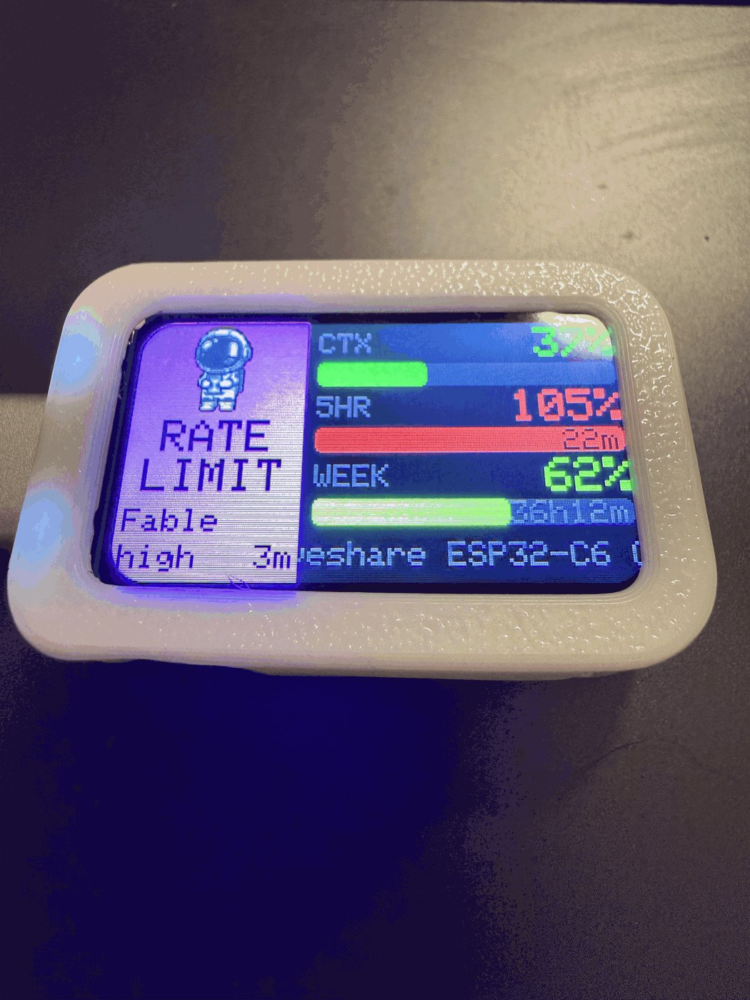
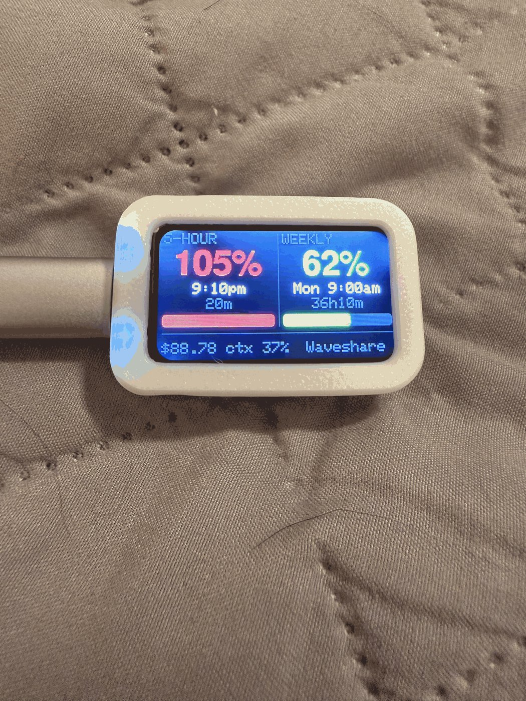
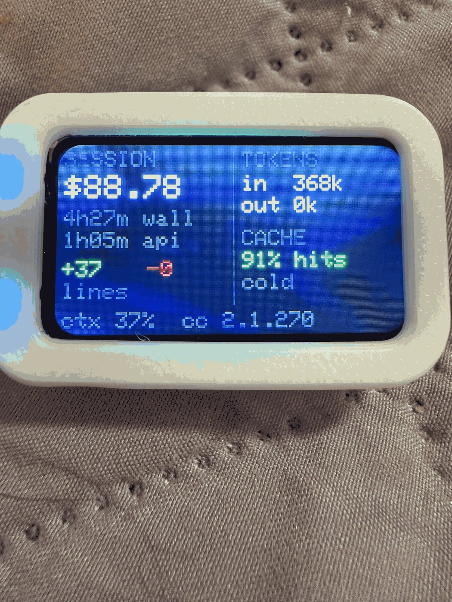

# Claude Code status display

A desk gadget that shows what Claude Code is doing, on a $20 ESP32 board with a 1.47"
screen. Context window, 5-hour and weekly rate limits, whether Claude is working or
waiting on you, and whether the Claude API is healthy. The RGB LED under the board
mirrors the state so you can read it from across the room.



The band on the left is the state. Here the 5-hour window is spent, so the band and the
LED both go magenta. The gauges slide green through yellow to red as they fill.

| Limits page | Stats page |
| --- | --- |
|  |  |

## What you need

- **Waveshare ESP32-C6-LCD-1.47** (the non-touch model, about $20). No other hardware,
  no soldering. The microSD slot and the second radio go unused.
- **A Mac.** A launchd agent pushes status to the board. The daemon itself is portable
  Python, but the installer and the service definition are macOS-only. Linux would need
  a systemd unit; nobody has written one.
- **A Claude Pro or Max subscription** for the rate-limit gauges. Those fields are absent
  on API-key billing, and the 5HR and WEEK bars will sit empty. Everything else still works.
- Optionally a printed case. The photos above use a snap-fit design from MakerWorld;
  see Hardware notes.

## Pieces

| Path | Role |
| --- | --- |
| `firmware/claude_status/` | Arduino sketch (ESP32-C6, ST7789 172x320, WS2812 LED, BOOT button). |
| `firmware/claude_status/sprite_*.h` | 64x64 RGB565 pixel-art astronaut mascot, one pose per state, generated by `host/gen_sprite.py`. |
| `host/claude_status_daemon.py` | uv script. Reads state files, polls status.claude.com, pushes JSON lines over USB serial. |
| `host/esp32-status-hook.sh` | Claude Code hook. Records per-session working / done / needs_input. Installed to `~/.claude/hooks/`. |
| `host/com.claude-status.display.plist` | launchd agent that keeps the daemon running. Installed to `~/Library/LaunchAgents/`. |
| `host/gen_sprite.py` | Gemini image generation + pixel-grid resampling to RGB565 (key colour 0xF81F). |

Data flow: `~/.claude/statusline.sh` mirrors its JSON to `~/.claude/esp32-status/sessions/<session_id>.json`.
Hooks write `~/.claude/esp32-status/attention/<session_id>.json`. The daemon merges the
newest session, the attention files, and the status page, then writes one JSON line to
`/dev/cu.usbmodem*` on change or every 3 s.

## Display

- Landscape by default (band on the left, gauges on the right); portrait layouts exist for every page.
- Band: mascot + state word. BUSY (blue, LED rainbow), READY (amber), NEEDS YOU (orange-amber),
  RATE LIMIT (magenta), OUTAGE (red), IDLE / NO LINK (grey). A red strip on the band
  means a major API incident while another state is showing.
- Three gauges: CTX, 5HR, WEEK. Big number is used %, with the % sign. Colour slides from
  green through yellow and orange to red as usage climbs, and pulses at 95% or more. Time-to-reset is printed inside
  the 5HR and WEEK bars. Reset times are 12-hour America/Chicago.
- Bottom row of the overview names the session being followed (it scrolls if too long): the session name if you set one
  with /rename, otherwise the project folder. The daemon follows whichever Claude Code session
  updated most recently, and the board flashes the new name when it switches.
- Health row replaces the session row when the Claude API or Claude Code component is not operational.
  The page-level indicator is ignored, so a Cowork-only incident does not raise a warning.
  Other components with issues are listed on the API page under "Other".
- Stale data (>10 min old) is drawn dim with a "?" in the band.

Pages (press BOOT): Overview → Limits detail → Stats (session cost, wall and API time,
lines changed, tokens, prompt-cache hit rate, the useful part of /usage) → API incident → About. Non-overview pages
return after 20 s. After 1 minute of idle, ready, or no-link the board cycles through the
pages (Overview, Limits, Stats, API, About) every 8 s; after 5 minutes the screensaver starts:
a drifting starfield, the mascot bouncing around the screen, the host clock, and the two
rate limits along the bottom. The LED runs a slow dim aurora while idle. Any tap or
state change wakes it.

## Colour language

The band colour and the LED colour come from one function, `stateRGB()`, so they are the
same colour by construction rather than by two lists someone has to keep in step. Only
the motion differs per state.

| State | Colour | LED motion |
| --- | --- | --- |
| BUSY | rainbow, one lap every 6 s (the band cycles with it) | steady at that hue |
| READY | amber `(255,165,0)` | three quick pulses, steady glow, softer after 2 min |
| NEEDS YOU | orange `(255,129,0)` | insistent breathe until acknowledged |
| RATE LIMIT | magenta `(255,0,255)` | slow breathe |
| OUTAGE | red `(255,0,0)` | breathe, or a red tick every 3 s over another state |
| IDLE | grey `(32,32,32)` | dim pilot light; a slow aurora once the screensaver runs |
| NO LINK | grey `(32,32,32)` | slow blink |

Tap BOOT to acknowledge an alert (LED drops to a steady glow). Hold 0.8 s toggles night
mode (LED capped, screen dimmer, no hard blinks). Hold 3 s rotates the screen 90° and
remembers it (landscape is the default). Night mode is automatic 22:00–07:00 Central from the daemon.

## Wi-Fi and Bluetooth

The board can run away from the laptop on any 5V USB-C source. Provision Wi-Fi once
over USB (the script pauses the daemon, prompts for the password without echo, generates
a shared token, and never prints or stores the password on the Mac):

**The ESP32-C6 radio is 2.4 GHz only.** A 5 GHz-only SSID will never associate; the board
just sits at "connecting". Most routers publish 2.4 GHz under a different name.

```sh
uv run --script host/provision.py --list     # Wi-Fi networks this Mac has saved
# password straight from 1Password, never printed or written to disk:
uv run --script host/provision.py --op "op://Private/Router/Wi-Fi/home-2.4" --ssid "NAME"
uv run --script host/provision.py --auto --ssid "NAME"   # password from the macOS keychain
uv run --script host/provision.py            # type it (needs a real terminal, not `!`)
uv run --script host/provision.py --status   # ip, rssi, ntp, ble, clock
uv run --script host/provision.py --forget   # wipe credentials from the board
```

The daemon pins itself to the board's numeric IP after first contact, because mDNS
resolution of `claude-status.local` can take five seconds on a cold cache.

Once joined, the board is `http://claude-status.local` with a small status page. The
daemon pushes to it automatically whenever the USB serial port is absent, using the
token in `~/.claude/esp32-status/token`. The board also fetches the Claude status page
itself every 90 s and sets its clock from NTP (Central, DST aware), so the API indicator
and clock stay right when the laptop is closed or away. Screenshots over Wi-Fi:
`uv run --script host/screenshot.py out.png --http claude-status.local --live`.

HTTP routes: `POST /status` (payload), `GET /shot` (framebuffer), `GET /cmd?c=tap|hold|rotate|sleep`,
`GET /info`, `GET /`. All accept `X-Token`.

Bluetooth LE advertises as "Claude Status" with one service: a read/notify characteristic
carrying `{"st","ctx","h5","wk","out","lim"}` and a write characteristic that accepts the
same JSON as serial, so a phone app such as nRF Connect can read state or provision Wi-Fi
without a cable. Build with `PartitionScheme=no_ota` (the radios need the 2 MB app slot).

## Recovery on a new machine

Everything needed is in this repo. Clone it and run:

```sh
./host/install.sh
```

That creates the state directories, installs the hook, patches `~/.claude/statusline.sh`
to mirror its payload (keeping a dated backup), registers the hooks in
`~/.claude/settings.json`, and writes and loads the launchd agent with paths pointing at
wherever you cloned it. It then prints the flash and Wi-Fi steps.

What the repo does **not** carry, by design: the Gemini API key (`.env.local`), the shared
HTTP token (regenerated by `provision.py`), and the board's Wi-Fi credentials (they live in
the board's own flash, and the password comes from 1Password at provisioning time).

If the board itself is replaced, flash the firmware and re-run `provision.py`. Nothing
else on the Mac needs to change.

## Build and flash

```sh
brew install arduino-cli
arduino-cli config set board_manager.additional_urls https://espressif.github.io/arduino-esp32/package_esp32_index.json
arduino-cli core install esp32:esp32
arduino-cli lib install "Adafruit GFX Library" "Adafruit ST7735 and ST7789 Library" "Adafruit NeoPixel" "ArduinoJson"

launchctl bootout gui/$(id -u)/com.claude-status.display   # free the serial port
arduino-cli compile --fqbn esp32:esp32:esp32c6:CDCOnBoot=cdc,PartitionScheme=no_ota --build-path firmware/build firmware/claude_status
arduino-cli upload  --fqbn esp32:esp32:esp32c6:CDCOnBoot=cdc,PartitionScheme=no_ota --port /dev/cu.usbmodem* --input-dir firmware/build firmware/claude_status
launchctl bootstrap gui/$(id -u) ~/Library/LaunchAgents/com.claude-status.display.plist
```

Daemon log: `~/.claude/esp32-status/daemon.log`. Run it by hand with
`uv run --script host/claude_status_daemon.py --verbose`.

## Sprites

`GEMINI_API_KEY` lives in `.env.local` (not committed). Regenerate a sprite:

```sh
uv run --script host/gen_sprite.py bot_done 48 "pixel art prompt..." --force
```

## Hardware notes

The TF (microSD) slot exists (CS GPIO 4, MISO GPIO 5, MOSI/SCLK shared with the LCD) but
**no SD code ships in the firmware**. The test card failed: a bit-banged CMD0 probe on the
raw pins showed the bus reading `FFFFFFFF` when deselected (so the read path is healthy)
yet the line pulled low and held on select, never returning `0x01`, across eight
spec-compliant cold starts, a full power cycle, and with the backlight off. The whole SD
stack was removed: it cost ~46 KB of a 2 MB app slot with no OTA, and nothing uses it.
Git history has the diagnostics if a different card is ever fitted.
The About page shows the card size, and `{"cmd":"sd"}` over serial reports type, size,
used space, and the root listing. Nothing is stored on it yet.

Wi-Fi 6 (2.4 GHz), BLE 5 and 802.15.4 radios on a ceramic antenna. No touchscreen, no IMU, no buzzer or haptic, no battery circuit. Inputs are the BOOT button (GPIO 9) and
RESET. A vibration motor or piezo could be added on a free GPIO via the header if wanted.

## Reliability

Built for unattended multi-week runs:

- A 30 s task watchdog reboots the board if the main loop stalls. The framebuffer dump
  feeds it per chunk and aborts on a short write, so a client that walks out of Wi-Fi
  range mid-screenshot cannot wedge the device.
- No dynamic strings on the hot paths. Serial lines land in a fixed buffer and an
  over-long line is dropped at the newline rather than truncated into a bad parse.
- One framebuffer is allocated once and shared across rotations. A failed allocation
  restarts cleanly instead of drawing into null.
- Bluetooth writes arrive on the BLE stack's task and are queued for the main loop
  rather than touching shared state directly.
- `/cmd` allowlists only the harmless UI verbs. mDNS registers its service once, not on
  every reconnect. The status poll is skipped when free heap is under 60 KB.
- `GET /info` reports `heap`, `minheap` and `uptime_s` for long-term monitoring.

## Known limits

- After you approve a permission prompt there is no "approved" hook event, so the
  band stays on NEEDS YOU until that tool finishes and PostToolUse fires.
- Only one process may hold the serial port. Never run the daemon by hand while the
  launchd agent is loaded; two writers interleave bytes and the device shows NO LINK.

## Verifying what the device shows

The firmware accepts host commands on the same serial line: `{"cmd":"shot"}` dumps the
live framebuffer, and `tap`, `hold`, `rotate`, `sleep` simulate the button. With the
launchd agent stopped, `host/screenshot.py` pushes a payload, presses buttons, and saves
a PNG of exactly what the panel is drawing:

```sh
launchctl bootout gui/$(id -u)/com.claude-status.display
uv run --script host/screenshot.py host/shots/live.png --live
uv run --script host/screenshot.py host/shots/needs.png --state needs_input
uv run --script host/screenshot.py host/shots/limits.png --cmd tap
launchctl bootstrap gui/$(id -u) ~/Library/LaunchAgents/com.claude-status.display.plist
```

`host/shots/_all.png` is a contact sheet of every state and page.

## License

MIT. See LICENSE.
